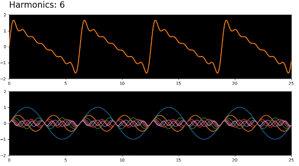

Additive Cymatics Animator
======
**The Cymatics Animator** is a python script for producing video files of progressive additive synthesis, demonstrating the audiovisual effect of the Fourier Theorem. Sine waves, representing the harmonics of a fundamental frequency, are gradually added one-by-one, until a final waveform is created. 

Waveform shapes include:
- Sawtooth (Even and Odd Harmonics)
- Square (Only Odd Harmonics)

With options to select:
- Fundamental Frequency
- Summation Speed
- Number of Harmonics to Add
- Output Directory


#### Screenshot


## Download
* [Version X.Y](https://github.com/username/sw-name/archive/master.zip)
* Other Versions

## Usage
```$ git clone https://github.com/username/software-project.git
...
```
## Contributors

### Contributors on GitHub
* [Contributors](https://github.com/username/sw-name/graphs/contributors)

### Translations
* [Transifex](https://www.transifex.com/projects/p/sw-name/)

### Third party libraries
* see [LIBRARIES](https://github.com/username/sw-name/blob/master/LIBRARIES.md) files

## License 
* see [LICENSE](https://github.com/username/sw-name/blob/master/LICENSE.md) file

## Version 
* Version X.Y

## How-to use this code
* see [INSTRUCTIONS](https://github.com/username/sw-name/blob/master/INSTRUCTIONS.md) file

## Contact
#### Developer/Company
* Homepage: 
* e-mail: 
* Twitter: [@twitterhandle](https://twitter.com/twitterhandle "twitterhandle on twitter")
* other communication/social media

[](https://flattr.com/submit/auto?user_id=username&url=https://github.com/username/sw-name&title=sw-name&language=&tags=github&category=software)