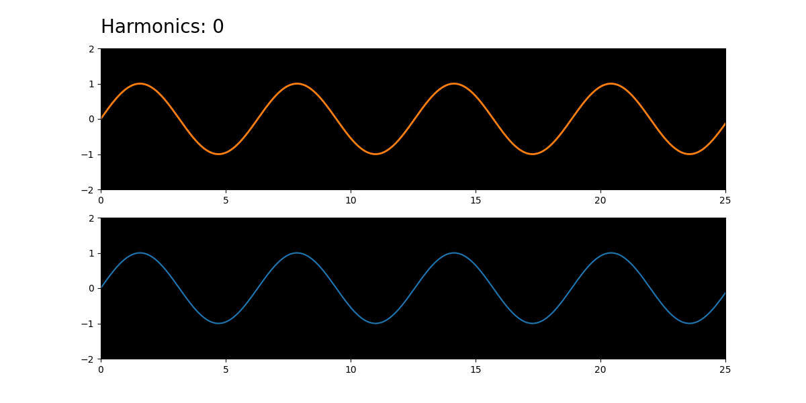

Additive Cymatics Animator
======
**The Cymatics Animator** is a python script for producing video files of progressive additive synthesis. The goal of the project is to allow for the convenient demonstration of the audiovisual effects of the Fourier Theorem.

Sine waves, representing the harmonics of a fundamental frequency, are gradually added one-by-one, until a final waveform is created. At every step of the video, the sound is updated in-sync.

Waveform shapes include:
- Sawtooth (Even and Odd Harmonics)
- Square (Only Odd Harmonics)

With options to select:
- Fundamental Frequency
- Summation Speed
- Number of Harmonics to Add
- Output Directory

#### Sample output of a sawtooth with 30 harmonics (it's a gif, so no audio)

## Usage
To get started, ensure that you have python 3 installed.

- Pip install from the requirements.txt file to obtain any necessary dependencies.  
- You can edit basic parameters in "additiveAnimator.py", such as the number of Harmonics, which Harmonic Series to use, fundamental frequency, etc.
- Execute additiveAnimator.py with python3. Upon completion,the media folder will be populated.
- Within the media folder, the file "output.mp4" now contains your audio-visual material.
